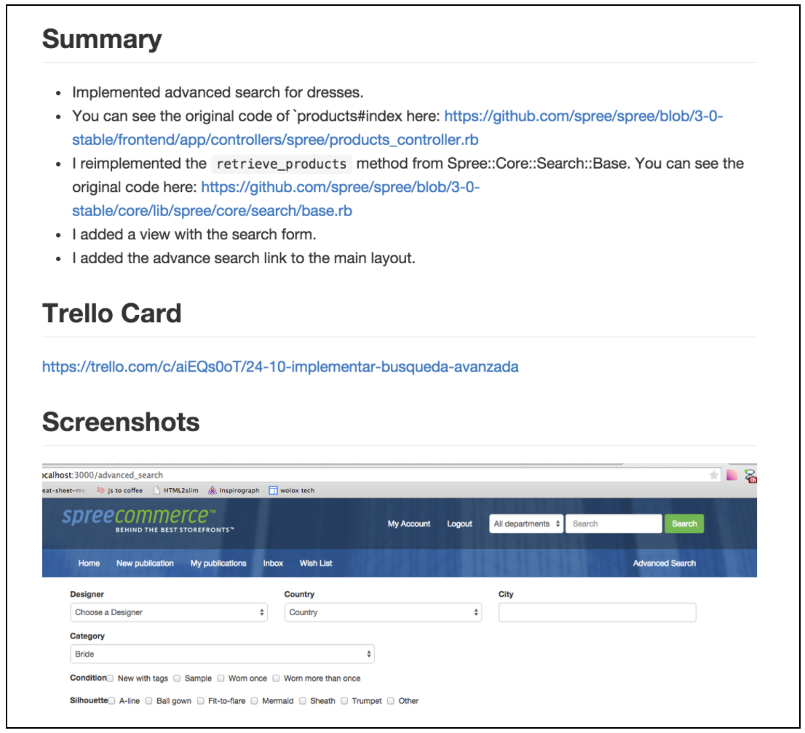
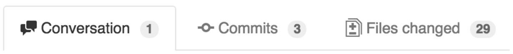
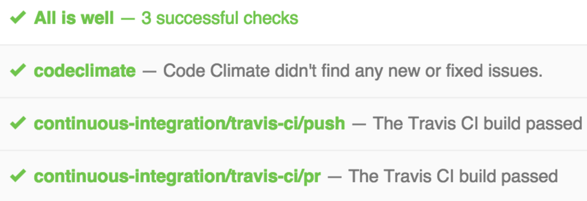

# Wolox Good Practices for Github Pull Requests

It's important to take into account these good practices to create Github Pull Requests. Creating good pull requests helps us to keep high code quality and to avoid bugs in our code.

A good pull request will look something like this:

When you are going to create a pull request take into account:

- Read [this link](https://help.github.com/articles/using-pull-requests/) to create a pull request.
- All the pull request content must be in english.
- A Pull request should be a small feature. Usually if a Pull request has more than 20 files changed then you may be adding lots of functionalities.
- A Pull request is a good place to discuss, ask and suggest improvements, that's the best way to learn and to improve your code.

## Pull Request Content

Every Pull Request should have the following information in Markdown style:

### Summary

Brief description of what you did and the trello card associated. If it’s a fix, explain what the problem was and how it was solved.

### Screenshots

If your code modifies front end views, then you should attach screenshots for every modification. You should add a screenshot of the original design and your implementation. You can use http://www.cockos.com/licecap/ for OSX and https://chrome.google.com/webstore/detail/gif-cat-animated-gif-capt/pdgpcobaomccdgnjjgbcacofhfnkdhbd?hl=en or https://wiki.ubuntu.com/CreatingScreencasts for Ubuntu to add animated gifs to your pull request to show some transitions between views.

### Known Issues/Notes

If you found any issues while developing the feature. This is the place where you should detail everything. Also you can report bugs found or any TODO feature.

### Trello Card

A long or short link to the trello card that is being developed.

> You can always add a new section that can help your code reviewer. For example: “Migrations needed”, “Scripts to run”, “Discussion”.

## Example

- You should analyze before starting your pull request which functionalities you are adding and consider dividing it in different small pull requests.
- Commits messages should be descriptive. Having a commit with the message: “Some fixes” it not descriptive, “Fixing products display in dashboard” is much better.
- When a pull request needs many fixes, you may end up finishing with lots of unnecessary commits. If you want to clean those commits you can squash them. Remember that if you use the git squash feature, you will need to push with --force and this is a bad idea when people are using your branch as a base branch for another feature (use --force-with-lease instead of --force).
- Build should be SUCCESS. If the repository includes continuous integration services like Travis, Wolox CI, then the build of the pull request should be success.

- You can set up git hooks to avoid forgetting to run tests and linters locally before you push your code.
- You should add tests every time you add new functionalities.
- Delete your branch after merging your pull request. You can do this from the same page you merge your branch.
- Before assigning a reviewer to the PR, you should check all the items described in this document. Looking at your own code is a good way to avoid silly errors like living a debug breakpoint.
- You shouldn’t upload secret credentials.

### When is a Pull Request ready to get merged?

A pull request is ready to be merged after the following two steps:

- All builds are SUCCESS.
- Code review: After creating a pull request, it must be assigned to a code reviewer using the assignees field. The code reviewer will check the code and may comment, request changes or approve. The pull request is approved when the code reviewer marks it as Approved. If the code reviewer requests changes, then you should generate new commits with the fixes requested. Never modify old commits because the code reviewer will use the diff to compare new changes. You can check more about this process here. Don’t forget to assign the reviewer back after you make all the fixes.
