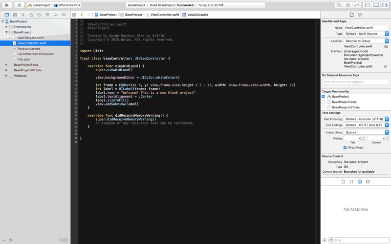

iOS Kickoff guide
-----------------

This is a tutorial explaining how to kickoff an iOS project from scratch. Some steps can't be followed without being granted access to certain services: request them to an iOS' technical leader:

* [Pablo Giorgi](mailto:pablo.giorgi@wolox.com.ar)
* [Guido Marucci Blas](mailto:guidomb@wolox.com.ar)

## Before starting...

The following will be needed to start an iOS project kickoff process:

* Have access to project's GitHub repository.
* Make sure `wolox-ci` GitHub user has writing access to repository.
* Have AmazonS3 credentials to configure [CarthageCache](https://github.com/guidomb/carthage_cache).
* Verify access to project's iOS devs email `PROJECT_NAME-dev-ios@wolox.com.ar`.
* Verify access to project's Trello board.
* Verify access to project's Google Drive.
* Have XCode and XCode Command Line Tools installed.
* Have git and [Homebrew](https://brew.sh) installed.
* Have [rbenv](https://github.com/rbenv/rbenv) installed.

## Kickoff

Next steps will get your iOS project configured, for these, replace `Project Name` with your project name.

A little heads up: It's *extremely* important naming conventions, such as camel case notation and so on, are followed. I.e.: if `BaseProject.xcodeproj` should be renamed with our project name, then it should be `ProjectName.xcodeproj`. Always follow the naming pattern on the base project. Also, this is meant to be sequentially, so don't skip or mix steps.

### Setup

#### Adding Base Project

First, clone the base project repository. The included project comes with a basic XCode configuration and includes the most useful/needed dependencies. To do this, run on your Terminal:

`$ git clone git@github.com:Wolox/ios-base-project.git`

We should then clone from GitHub the empty project repository for our `Project Name`, with ULR `https://github.com/Wolox/example-project-ios` and SSH URL `git@github.com:Wolox/project-name-ios.git`. On the same path/console, run:

`$ git clone git@github.com:Wolox/project-name-ios.git`

Clone the repository.

`$ rsync -av --progress ios-base-project/. project-name-ios --exclude .git`

Fast copy everything but the .git file from base project to your project.

`$ cd project-name-ios`

Change to your project directory.

`$ git add .`

Don't forget to add the changes.

`$ git commit -m "Initial commit"`

Watch the message! This will be your project's first commit ;)

`$ git push origin HEAD -u`

Then send it to the clouds!

When these is done a new branch should be created to properly set up the project. Once again, run on your terminal:
`$ git checkout -b "project-setup" `

#### Project Renaming

Open XCode project by running:

`$ open BaseProject.xcodeproj`

Change its name from `BaseProject` to your own `ProjectName`, following [this]((https://developer.apple.com/library/ios/recipes/xcode_help-project_editor/RenamingaProject/RenamingaProject.html)) tutorial.

After doing this you'll note that still the `ProjectName`'s `Scheme` hasn't been renamed. To do this, duplicate the actual scheme and rename it, only then delete the old scheme. While editing the scheme, tick the `shared` option so project can be run on CI environment.



Folders and groups should also be renamed. Run the following on your console to fasten the process:

`$ brew install rename ack`
`$ find . -name 'BaseProject*' -print0 | xargs -0 rename -S 'BaseProject' 'ProjectName'`
`$ ack --literal --files-with-matches 'BaseProject' | xargs sed -i '' 's/BaseProject/ProjectName/g'`

Verify every `BaseProject` appearance has been renamed, running:

`$ ack --literal 'BaseProject'`

If this hasn't print out anything, you are good to go!

#### Build Scripts Configuration

Renaming is over! Time to move on to configuring the [build scripts](https://github.com/guidomb/ios-scripts) file. To do this, edit the `script/.env` file, which should already contain the following:

```
REQUIRED_SWIFTLINT_VERSION=0.9.2
REQUIRED_CARTHAGE_VERSION=0.15.1
CARTHAGE_BUILD_PLATFORM=${CARTHAGE_BUILD_PLATFORM:-"iOS"}
CARTHAGE_NO_USE_BINARIES=${CARTHAGE_NO_USE_BINARIES:-"false"}
LINT_PODSPEC=${LINT_PODSPEC:-"yes"}
PROJECT_NAME=BaseProject
XCODE_WORKSPACE=
XCODE_PROJECT=BaseProject.xcodeproj
IOS_DESTINATION_VERSION=${IOS_DESTINATION_VERSION:-"latest"}
IOS_DESTINATION_SIMULATOR_NAME=${IOS_DESTINATION_SIMULATOR_NAME:-"iPhone 6"}
OSX_DESTINATION_ARCH=${OSX_DESTINATION_ARCH:-""}
INSTALL_GITHOOKS=true
```

Replace the values for `PROJECT_NAME` and `XCODE_PROJECT` with the following ones:

```
PROJECT_NAME=ProjectName
XCODE_PROJECT=ProjectName.xcodeproj
```

Run bootstrapping script, which will install every necessary dependency to build the project:
`$ ./script/bootstrap `

This will configure [CarthageCache](https://github.com/guidomb/carthage_cache) locally and generate a `.carthage_cache.yml` file. Have your AWS credentials handy: you'll need the `access key ID` and `secret access key` from the account with access to the `carthage-cache` bucket. Configure `us-west-2` as region. When done, you should see this message on the console:

```
ProjectName successfully bootstrapped

Useful scripts:

 * 'script/test' to run tests.
 * 'script/build' to build the project.
 * 'script/update' to update project's dependencies.

You can start hacking by executing:

   open ProjectName.xcodeproj

```

#### Wrapping up

Make sure the project can be built and run it on the simulator (⌘ + R). You should see the following screen:

 

 Add these changes by running:
 `$ git add .`

And commit them:
`$ git commit -m "Rename project"`

### Configure GitHub

#### Protect Master

* [Configuring protected branches](https://help.github.com/articles/configuring-protected-branches/)
* [Enabling required status checks](https://help.github.com/articles/enabling-required-status-checks/)

#### Disable "Squash & Merge"

* [Configuring pull request merge squashing](https://help.github.com/articles/configuring-pull-request-merge-squashing/)
