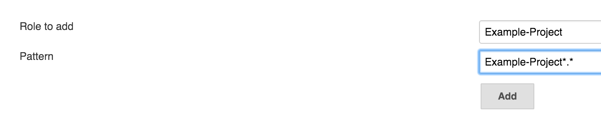

Ruby On Rails Kickoff guide
-------------------------

The following guide explains how to make a Ruby On Rails (RoR) project kickoff from scratch. 

## Requirements

Before you start with this step by step guide you will need the following:
  * Access to the Github repository where the code of the kickoff will be. If the repository is not created ask the TM from this project for it.

## Kickoff

The following steps will help you have a RoR project ready for new features. We are going to use an example project with the name `example-project`. Everytime you see `Example Project` in this guide, you should replace it with your project name. It is important to respect all the name conventions. For example, if you see `Example Project` in this guide, you should replace it and respect the CamelCase notation.

### Clone and project base setup

#### Adding base project

The first thing you need to do is to clone the base project we have at Wolox that includes many of the common tools we use everyday, in almost every project.

The we are going to create a development branch so we can make an pull request to master and check the CI integrations. It is important that you leave master empty.

For this open your terminal and execute:

  ```bash
    git clone git@github.com:Wolox/rails-bootstrap.git
    cd ..
    cp -r rails-bootstrap/ example-project
    cd example-project
    rm -rf .git
    git init
    git remote add origin git@github.com:Wolox/example-project.git
    git commit --allow-empty -m 'Initial Commit'
    git push origin master -f
    git checkout -b development
  ```

Then you need to run the script that changes all the names of the base project to the one you really want. To do this run:

```bash
    ./script/bootstrap example-project
  ```

This will replace all the `RailsBootstrap` things in the base project with `ExampleProject`

Now you are ready to commit the Initial Commit code by running:

  ```bash
    git add .
    git commit -m "Kickoff"
    git push origin development
  ```

Because you don't have any tests. You should change the `.codestats.yml` file to test coverage `minimum: 0`. Now you are ready to make a pull request to master and notify infraestructura@wolox.com.ar for the CI setup.

### Update README.md

Lets add some project details to the `README.md` to finish with the Kickoff. Replace all the variables with a `%` with its corresponding value. They should go below the project title on top of the README.md file:

* `%project-description`: Brief description of the project.
* `%tm-full-name`: Full name of the TM of the project with a link to its email.
* `%sm-full-name`: The full name of the Scrum Master of the project with a link to their email.
* `%pa-full-name`: The full name of the Project Architect of the project with a link to their email.
* `%project-trello-url`: URL of the Trello Board.
* `%project-google-drive-url`: URL of the Google Drive folder.

You are now ready to make a new commit and test everything.

  ```bash
    git add README.md
    git commit -m 'Kickoff'
    git push origin development
  ```

## Wolox CI (For infraestructure only)

## Github configuration

[Wolox CI](http://ci.wolox.com.ar) will run tests, linters and other checks everytime someone creates a Pull Request, changing the build status when it finishes. Wolox CI runs with [Jenkins](https://jenkins.io/). Github sends a webhoook to Wolox CI everytime a new Pull Request is created, so you will need to setup this first. You will need to access [http://ci.wolox.com.ar/authorize?project=example-project&tech=rails](ci.wolox.com.ar/authorize?project=example-project&tech=rails) repacling `example-project` again.

This will create a new Credential in Jenkins and create an `Example-Project` under the `Actives Pull Requests` tab and an `Example-Project-Base` and the `Actives Base Branch` tab. Notice the name of the Credential that is created.

Go back to [Wolox CI](http://ci.wolox.com.ar) and press the `Actives Pull Requests` tab and find `Example-Project`. Go to `configure` in the left sidebar.

This will redirect you to the new project configuration page where you need to replace `ror-example-project` with `example-project`. The things you need to replace are:

 - Project url
 - Repository URL and Credential. Here you should be able to choose from the dropdown a credential called `example-project`.
 - Email Notification Recipients with the developers team mail already mentioned above.
 - In `Projects to build` you need to add `Example-Project-Base`. Don't forget the `Base` part.

Press `SAVE`.

Now you need to modified the Base branch that was automatically created before. You need to do a similar step as before:

Go back to [Wolox CI](http://ci.wolox.com.ar) and press the `Actives Base Branch` tab and find `Example-Project-Base`. Go to `configure` in the left sidebar.

Like we did before, replace:

 - Project url
 - Repository URL and Credential. Here you should be able to choose from the dropdown a credential called `example-project`.
 - Email Notification Recipients with the developers team email already mentioned above.

Press `SAVE`.

With all this setup, the pull requests will start running with Wolox CI. We are missing the access grant for the developers.

Go to [http://ci.wolox.com.ar/role-strategy/manage-roles](http://ci.wolox.com.ar/role-strategy/manage-roles). In `Role to add` add your new project name. For example: `Example-Project` and in `Pattern` add your project name with `*.*` at the end. For example: `Example-Project*.*`. Press `Add`. A new row will be added to the `Project roles` table. In that row check the `Build` `Read` and `ViewStatus`. Then press `Save`.



Now go to [http://ci.wolox.com.ar/role-strategy/assign-roles](http://ci.wolox.com.ar/role-strategy/assign-roles). Here you will grant access to the developers one by one to the project. First be sure the developer is added to the `Global roles` table with `wolox` option checked. Then go to the `Project roles` tables and check the project name in the user role. Then press `Save`. If you don't know the username you need to add, you can check them [here](http://ci.wolox.com.ar/asynchPeople/). Repeat this for all of the developers.

You can now add the Wolox CI badge to the `README.md`. The url will be `[](http://ci.wolox.com.ar/job/Example-Project)`. Replace `Example-Project` with your Wolox CI project.
