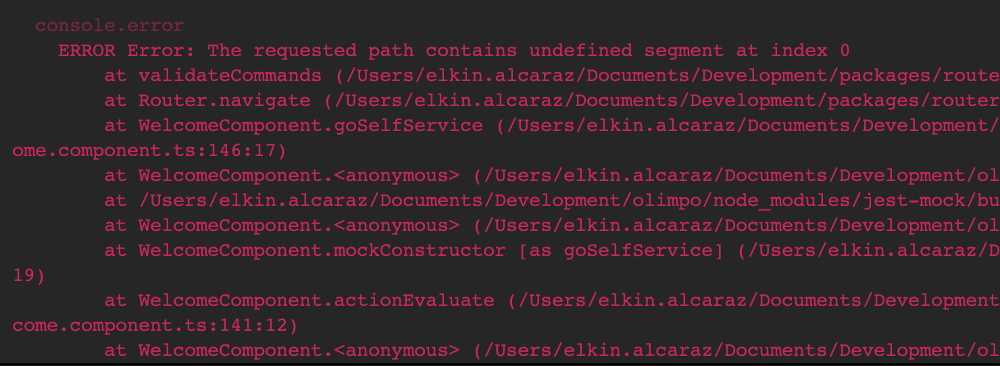

## Issues

### i18n dependency

#### Issue:
If you test suit fails to run, with the following error message:
```ts
● Test suite failed to run

    It looks like your application or one of its dependencies is using i18n.
    Angular 9 introduced a global `$localize()` function that needs to be loaded.
    Please run `ng add @angular/localize` from the Angular CLI.
    (For non-CLI projects, add `import '@angular/localize/init';` to your `polyfills.ts` file.
    For server-side rendering applications add the import to your `main.server.ts` file.)
```

#### Solution:
This mean that your module uses i18n, you'll need to expose the ```$localize``` function in the global namespace. This need to be imported on the ```test-setup.ts``` file.

```ts
import 'jest-preset-angular';
import '@angular/localize/init';
```

### Navigator dependency
Sometimes, when we are testing many problems don’t let our test execute. Is so frustrating don't find a simple solution just checking the error console and understanding the problem. This is a collection of typical errors that you can get when you are testing. Hope that helps.

### Error with the navigator
#### Issue:
If we use the navigator router on the test files, maybe we get an error like this:
;
This means we are using a specific path to test the routing. But we aren’t declaring on the environments file.

For example, this component:
```ts
@Component({
  ...
})
export class ExampleComponent {
  ...
  
  goSelfservice(): void {
    this.router.navigate([this.environments.urls.ssPath]);
  }
}

```

And the test file:
```ts
describe('ExampleComponent', () => {
  let component: ExampleComponent;
  let fixture: ComponentFixture<ExampleComponent>;

  beforeEach(async () => {
    await TestBed.configureTestingModule({
      declarations: [ExampleComponent],
      providers: [
        {
          provide: 'environment',
          useValue: {
            urls: {
              ssPath: 'any-path',
              ...
            }
          }
        }
      ]
    }).compileComponents();
  });
}

```
#### Solution:
To avoid the error, we need to declare the same routes on providers defined on the component.
Note: The urls object can be declared on extra file.

## Error with the ChangeDetectionStrategy
When a component has the detection strategy configured with OnPush. And, we try to get some element of the DOM, surprisingly the element has not rendered. This is because the test DOM doesn’t read the changes has the real component this occurred when having directives as ```*ngIf``` on the HTML. To fix this problem, we have two options:

1] (recommended) We can use a helper function to detect changes correctly on our tests. The function ```detectChangesOnPushStrategy``` is asynchronous, so you’ll need to add async() to the tests were you need to detect the changes.

```ts
import { ComponentFixture } from '@angular/core/testing';
import { ChangeDetectorRef } from '@angular/core';
/**
 * Force the change detection on a component
 * with change strategy onPush
 * @param fixture fixture of the component to test
 */
export const detectChangesOnPushStrategy = async <T>(
  fixture: ComponentFixture<T>
): Promise<void> => {
  const changeDetectorRef = fixture.debugElement.injector.get<
    ChangeDetectorRef
  >(ChangeDetectorRef);
  changeDetectorRef.detectChanges();
  return fixture.whenStable();
};
```

```ts
describe('ExampleComponent', () => {
  let component: ExampleComponent;
  let fixture: ComponentFixture<ExampleComponent>;

  beforeEach(async () => {
    await TestBed.configureTestingModule({
      declarations: [ExampleComponent],
    }).compileComponents();
  });
  
  it('should detect the change', () => {
    component.showElement = true;
    await detectChangesOnPushStrategy<ExampleComponent>(fixture);
    const element = fixture.debugElement.query(By.css('tag'))
    expect(element).toBeTruthy();
  });
}
```
This solution came from [here](https://stackoverflow.com/questions/42656045/angular2-testing-and-resolved-data-how-to-test-ngoninit)

2] Optionally, we could override our TestingModule to use the default change detection, then, the component will be rendered correctly.
```ts
describe('ExampleComponent', () => {
  let component: ExampleComponent;
  let fixture: ComponentFixture<ExampleComponent>;

  beforeEach(async () => {
    await TestBed.configureTestingModule({
      declarations: [ExampleComponent],
    })
      .overrideComponent(ExampleComponent, {
        set: { changeDetection: ChangeDetectionStrategy.Default },
      })
      .compileComponents();
  });
}
```

We recommend to use the first option, due to the fact that we don't modify the original behavior of the component.
