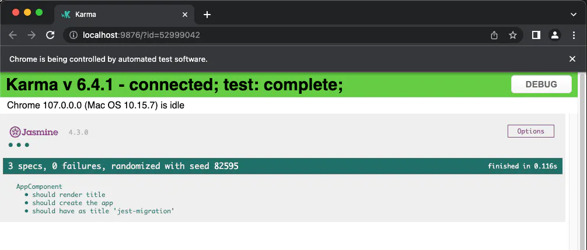
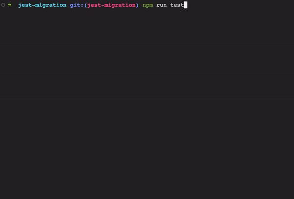

## Migrating your Angular project from Karma & Jasmine to Jest:

Your projects will use Karma and Jasmine by default if you use the [Angular schematics](https://angular.io/guide/schematics). However, the migration is pretty simple. Let's check what we need to do:

For this example, I'm going to use a basic Angular project created with the `ng new` schematics:

Then, if I run the command:
```bash
npm run test
```
I'll get:

;

As you can see, all my test cases are running and passing without any problems. The idea at the end of the migration is to get the same result but using Jest.

Let's start with the migration:

1. Installing the jest dev dependencies
```bash
npm install jest jest-preset-angular --save-dev
```

2. Creating the jest configuration file

In your root folder, create a file called: `jest.config.js` and add the following configuration:

```javascript
module.exports = {
  preset: 'jest-preset-angular',
  setupFilesAfterEnv: ['<rootDir>/setup-jest.ts'],
  collectCoverage: true,
  coverageReporters: ['text'],
  roots: ['<rootDir>/src/'],
  testMatch: ['**/+(*.)+(spec).+(ts)'],
  setupFilesAfterEnv: ['<rootDir>/src/test.ts'],
  collectCoverage: true,
  coverageReporters: ['html', 'text']
};
```
This configuration will show all the relevant information on the command line when you run the test command.

3. In your `package.json` let's update the test script:

```json
{
  ...
  "scripts": {
    ...
    "test": "jest"
    ...
  },
  ...
}
```

4. Update the global test file. 

Go to `src/test.ts` and replace all the content with:

```typescript
import 'jest-preset-angular/setup-jest';

Object.defineProperty(window, 'CSS', {value: null});
Object.defineProperty(window, 'getComputedStyle', {
  value: () => {
    return {
      display: 'none',
      appearance: ['-webkit-appearance']
    };
  }
});

Object.defineProperty(document, 'doctype', {
  value: '<!DOCTYPE html>'
});

Object.defineProperty(document.body.style, 'transform', {
  value: () => {
    return {
      enumerable: true,
      configurable: true
    };
  }
});
```
This file will refer to Jest and not to Karma.

5. Uninstall Karma & Jasmine In order to get rid of all the Karma & Jasmine dependencies let's run:

```bash
npm uninstall karma karma-chrome-launcher karma-coverage-istanbul-reporter karma-jasmine karma-jasmine-html-reporter
```

6. Finally, you could delete the `karma.conf.js` file.

Now, let's run 
```bash
npm run test
```
And you should get something like this:

;

That's it, we just migrate Jest into an existing Angular project. All the code can be found in this [Repository](https://github.com/Andres2D/angular-jest-migration). Go to the branch `jest-migration` to see the final result.
