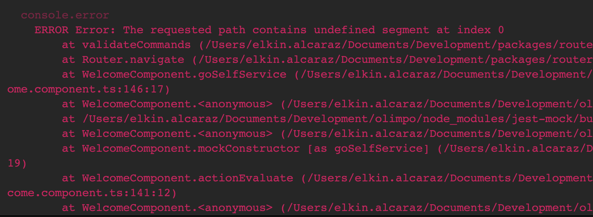

# Unit test with Jest 

## Topics
- [Unit test with Jest](#unit-test-with-jest)
  - [Topics](#topics)
  - [Whats is testing? and why is important?](#whats-is-testing-and-why-is-important)
  - [Benefits](#benefits)
- [Options to test?](#options-to-test)
- [Jest](#jest)
- [Basic structure of a test](#basic-structure-of-a-test)
- [Jest hooks](#jest-hooks)
  - [Repeating setUp](#repeating-setup)
  - [One time setUp](#one-time-setup)
- [How to spy functions calls](#how-to-spy-functions-calls)
  - [Spy local function](#spy-local-function)
- [Spy external function](#spy-external-function)
  - [Router](#router)
  - [ActivatedRouter](#activatedrouter)
  - [Private functions](#private-functions)
- [How to get elements from the DOM on testing](#how-to-get-elements-from-the-dom-on-testing)
  - [Getting element](#getting-element)
  - [Testing a class](#testing-a-class)
  - [Angular default test configuration](#angular-default-test-configuration)
    - [Understanding TestBed :test_tube:](#understanding-testbed-test_tube)
    - [Fixture and Component :statue_of_liberty:](#fixture-and-component-statue_of_liberty)
    - [Init the fixture](#init-the-fixture)
    - [Init the component](#init-the-component)
    - [fixture.detectChanges()](#fixturedetectchanges)
  - [HttpClientTestingModule](#httpclienttestingmodule)
  - [Issues](#issues)
    - [i18n dependency](#i18n-dependency)
    - [Navigator dependency](#navigator-dependency)
    - [Error with the navigator](#error-with-the-navigator)
  - [Error with the ChangeDetectionStrategy](#error-with-the-changedetectionstrategy)


## Whats is testing? and why is important?
Testing is a method to check if the code is working as expected. Testing the code helps to detect bugs on time and prevent the appearance of new bugs in the future. Also, testing gives confidence to our code. We can expect that they don't find problems in QA tests.
## Benefits
* Fewer bugs in production
* Fewer code regressions
* More maintainable code
* Faster refactoring and upgrades
* Less dead code
* You can see more on this [article](https://jestjs.io/docs/using-matchers).

# Options to test?
Let’s see three ways to test in Angular:
1 - Angular - Jasmine - Karma
* Is established for Angular. We can find a lot of documentation about it.
* Karma includes options to test the code in multiple browsers.
* Don’t have dependencies.

2 - Angular - Jest :star: 
* Jest is faster than Karma.
* Includes better reports of testing.
* Coverage integrated.
* Contain a complete interface of commands.

3 - Angular - Jest - Angular test library
* Contains all the Pros of Jest.
* Focused on user interface testing.

# Jest
Jest is a JavaScript test runner that helps us define tests in our code. Jest is not exclusive to Angular, Jest is for every JS framework. It is for this reason that we can find a lot of documentation about it. Also, Jest has a big community of developers.

Jest includes extensive options to configure the environment of tests. Like integrated coverage and command options. Also, Jest is very fast and we can spend less time developing our tests.

You can see more about jest [here](https://jestjs.io/docs/getting-started).

# Basic structure of a test 
````ts
    🏷️ describe('Class, Module, Service or Component to test', () => {
        //test
       🌱️ it('should do ...', () => {
            // setup
            const service = new ServiceToTest();
            // assertion and matcher
           🔍️️ expect(service.fn)️.🧪toBe('expected value');
        });
    });
````
🏷  First use ```describe```to define the scope of the tests, this can contain one o more test, inside yo define the name of the class that you wanna test, next put a call back ```,() =>```

🌱 Now use ``it`` to define your test, inside describe the specific name of your test, and next put a call back ```,() =>```

🔍️️  The soul of your test is the ```assertion ```this is defined as ```expect()```follow of the variable that you want to improve.

🧪 All assertion is pair with a ```matcher``` with this you can evaluate the result of your variable, you can get all the matcher of Jest on this [link](https://jestjs.io/docs/using-matchers).

# Jest hooks

## Repeating setUp
You can use ```beforeEach()``` and/or ```afterEach()``` if you need to set or clear data for each test.

```beforeEach``` example:
```ts
    describe('UsersClass', () => {
        beforeEach(() => {
            initUsersDB();
        });
        
        it('should test1', () => {...})
    });
```
in this example the Users **DB** will be initialized before the execution of any test

****************

```afterEach``` example:
```ts
    describe('UsersClass', () => {
        afterEach(() => {
            clearUsersDB();
        });
        
        it('should test2', () => {...})
    });
```
in this example the Users **DB** will be cleared after the execution of any test.
 
## One time setUp
In case that you need to set data before or after of any test but this data will be same instance for all the test, you can use the ```beforeAll()``` and/or ```afterAll()```.

You can get more information of this Hooks on [JEST](https://jestjs.io/docs/setup-teardown#scoping).

# How to spy functions calls
When we are testing we can spy the call of an expecific function, th function to spy can be of the same component or another external dependency.

## Spy local function
Component
````ts
@Component({
  selector: 'app-example',
  templateUrl: `
    <div class="section" (click)="log('test')">
        Click me
    </div>
  `
})
export class ExampleComponent {
    log(message: string): void {
        console.log(message); 
    }
}
````

Test
````ts
it('should call log function', () => {
    const spy = jest.spyOn(component, 'log');
    fixture.nativeElement.querySelector('.section').click();
    expect(spy).toHaveBeeCalledWith('test');
});
````

# Spy external function
Component
````ts
@Component({
  selector: 'app-example',
  templateUrl: `
    <div class="section" (click)="log('test')">
        Click me
    </div>
  `
})
export class ExampleComponent {
    constructor(private logService: LogService){}

    log(message: string): void {
        this.logService.log(message); 
    }
}
````

Test
````ts
const fakeLogService = {
    log: jest.fn()
}

describe('ExampleComponent', () => {
    beforeEach(() => {
        TestBed.configureTestingModule({
          declarations: [ExampleComponent],
          providers: [
            {
                provide: LogService,
                useValue: fakeLogService
            }
          ]
        });
    })
    
    it('should call log function', () => {
        fixture.nativeElement.querySelector('.section').click();
        expect(fakeLogService.log).toHaveBeeCalledWith('test');
    });
}
````

## Router
You can spy the functions of the ``Router`` as follows:
Test
````ts
const fakeRouter = {
  navigate: jest.fn()
}

describe('ExampleComponent', () => {
    beforeEach(() => {
        TestBed.configureTestingModule({
          declarations: [ExampleComponent],
          providers: [
            {
                provide: Router,
                useValue: fakeRouter
            }
          ]
        });
    });
    
    it('should redirect to page', () => {
        fixture.nativeElement.querySelector('.link').click();
        expect(fakeRouter.navigate).toHaveBeeCalledWith(['/page']);
    });
}
````

## ActivatedRouter
Many components has resolver files to get the data before to navigate to the view, and in the ```ngOnInit()``` is common to see somethig like this:
``` this.data = this.route.snapshot.data.resolved; ``` son we need the mock the resolver data on this way:

````ts
const fakeActivatedRouter = {
  snapshot: {
      data: {
          resolved: {
              // your resolved data here
          }
      }
  }
}

describe('ExampleComponent', () => {
    beforeEach(() => {
        TestBed.configureTestingModule({
          declarations: [ExampleComponent],
          providers: [
            {
                provide: ActivatedRoute,
                useValue: fakeActivatedRouter
            }
          ]
        });
    });
}
````

## Private functions
Sometimes we have private functions on our components, so to spy this functions you should:
Component
````ts
@Component({
  selector: 'app-example',
  templateUrl: `
    <div class="section" (click)="log('test')">
        Click me
    </div>
  `
})
export class ExampleComponent {
    constructor(private logService: LogService){}

    private log(message: string): void {
        this.logService.log(message); 
    }
}
````
Test
````ts
it('should call the private function', () => {
    const spy = jest.spyOn(ExampleComponent.prototype as any, 'log');
    fixture.nativeElement.querySelector('.section').click();
    expect(fakeLogService.log).toHaveBeeCalledWith('test');
});
````

# How to get elements from the DOM on testing
Check if an element render the correct information on the page is very important to test and more if we are frontend developers, so to test the elements you need to access to the elements and also call his events.

## Getting element
Consider the next element
test.html
```html
<button class="btn_login" (click)="login()">Login</button>
```

test.spect.ts
```ts
it('should call login function', () => {
    // as nativeElement
    const button = fixture.debugElement.nativeELement.querySelector('.btn_login');
    button.click();
    
    ...
    
    // as debugElement
    const button = fixture.debugElement.query(By.css('.btn_login'));
    button.triggerEventHandler('click', null);
    
});
```
You can see more about ```nativeElement vs debugElement``` on this [link](https://angular.io/guide/testing-components-basics), also note that in debugElemente we use the css class from ```By``` to use this you need to import from ```import { By } from '@angular/platform-browser';``` an you can see more info abput ```By``` on this [link](https://angular.io/api/platform-browser/By)

Consider the nexts elements
test.html
```html
<app-header-proccess
    [tabs]="data.tabs"
    (goTo)="goToPage($event)">
</app-header-proccess>

<h1 class="title">{{data.title}}</h1>

<ul>
    <li class="list-item-data" *ngFor="let items from data.list">
        <p class="item-title">{{item.title}}</p>
    </li>
</ul>
```
To get any of this elements we can use:
test.spec.ts
```ts
it('should render information', () => {
    // get component
    const header = fixture.debugElement.query(By.css('app-header-proccess'));
    header.triggerEventHandler('goTo', '/main');
    expect(goToPage).toHaveBeenCalledWith('/main');
    
    // get Texts elements
    const title = fixture.debugElement.query(By.css('.title'));
    expect(title.nativeElement.textContent).toBe('any text');
    
    // get Iterable Elements
    const liItems = fixture.debugElement.queryAll(By.css('.list-item-data'));
    expect(liItems.length).toBe(5);
    
});
```

## Testing a class
To test a class, we need to instance it with the dependencies. Then, we can call all the methods and add assertions, for example:

```ts
import { Injectable } from '@angular/core';
import { LoggerService } from './logger.service';
@Injectable({
  providedIn: 'root',
})
export class CalculatorService {
  constructor(private readonly logger: LoggerService) {}

  add(n1: number, n2: number) {
    this.logger.log('Addition operation called');
    return n1 + n2;
  }

  subtract(n1: number, n2: number) {
    console.log('Subtraction operation called');
    return n1 - n2;
  }
}
```

```ts
class FakeService {
  log() {}
}

describe('Calculator service', () => {
  it('should call addition function', () => {
    const service = new CalculatorService(fakeObj);
    const result = service.add(2, 3);
    expect(result).toBe(2 + 3);
  });
});
```
See more on [kavak-test-cap](https://github.com/CrisVega08/kavak-test-cap).

## Angular default test configuration
When you create a new component, directive, service, etc. The default configuration of the tests file is something like this.
```ts
import { ComponentFixture, TestBed } from '@angular/core/testing';
import { ExampleComponent } from './example.component';

describe('ExampleComponent', () => {
  let component: ExampleComponent;
  let fixture: ComponentFixture<ExampleComponent>;

  beforeEach(async () => {
    await TestBed.configureTestingModule({
      declarations: [ ExampleComponent ]
    })
    .compileComponents();
  });

  beforeEach(() => {
    fixture = TestBed.createComponent(ExampleComponent);
    component = fixture.componentInstance;
    fixture.detectChanges();
  });

  it('should create', () => {
    expect(component).toBeTruthy();
  });
});
```

This is the default configuration of a test file. As you can see, it uses a lot of what we already got on the top theory. Now let's go to understand the TestBed.

### Understanding TestBed :test_tube:
TestBed is a utility of [Angular](https://angular.io/api/core/testing/TestBed). With this, we can configure all the environments of our tests.

Configure a testing module
With this we can set all the dependencies for our tests, for example:
```ts
TestBed.configureTestingModule(
    {
        declarations: [ ExampleComponent, OtherComponents ... ],
        imports: [ PipesModule, RouterTestingModule, OtherModules... ],
        providers: [ ExampleService, DecimalPipe, ... ],
    },
    schemas: [CUSTOM_ELEMENTS_SCHEMA],
);
```
As you can see, is equal to any angular module configuration

### Fixture and Component :statue_of_liberty: 
Usually, when we need to test the render of the application, we declare fixture to get access to the render HTML and component to get the control of our class.

### Init the fixture
fixture = TestBed.createComponent(ExampleComponent);
This creates a background render of our component and is stored on fixture

### Init the component
component = fixture.componentInstance;
In componenent, we store the instance of the class. Now, we can access the properties and methods of our class.

### fixture.detectChanges()
Works like the OnPush detection strategy. With this function, we can update the render of our test, in case we need to use it.

## HttpClientTestingModule
To test services with the [HttpClient](https://angular.io/api/common/http/HttpClient) dependency, we can use the utilities of Angular testing. We don't need to use all the object utilities of HttpClient, so we use [HttpClientTestingModule](https://angular.io/api/common/http/testing/HttpClientTestingModule#description) to test, this is a soft module designed just for testing. For example:
```ts
import { Injectable } from '@angular/core';
import { HttpClient } from '@angular/common/http';
import { Observable } from 'rxjs';
import { Car } from '../models/cars';

@Injectable({ providedIn: 'root' })
export class CarService {
  constructor(private http: HttpClient) {}

  findCarById(carId: number): Observable<Car> {
    return this.http.get<Car>(`api/cars/${carId}`);
  }

  findAllCars(): Observable<Car[]> {
    return this.http.get('api/cars') as Observable<Car[]>;
  }

  saveCar(carId: number, changes: Partial<Car>): Observable<Car> {
    return this.http.put<Car>(`api/cars/${carId}`, changes);
  }
}
```

```ts
import { TestBed } from '@angular/core/testing';
import {
  HttpClientTestingModule,
  HttpTestingController,
} from '@angular/common/http/testing';
import { CARS } from '../data/data';
import { CarService } from './car.service';
import { of } from 'rxjs';

describe('CarService Using HttpClientTestingModule', () => {
  let service: CarService;
  let controller: HttpTestingController;
  beforeEach(() => {
    TestBed.configureTestingModule({
      imports: [HttpClientTestingModule],
      providers: [],
    });

    service = TestBed.inject(CarService);
    controller = TestBed.inject(HttpTestingController);
  });

  it('create', () => {
    expect(service).toBeTruthy();
  });
```
In this section, we configure the testing module with the dependency HttpClientTestingModule


```ts
it('return all cars', (done) => {
    service.findAllCars().subscribe((cars) => {
      expect(cars).toEqual(CARS);
      done();
    });
    const req = controller.expectOne('api/cars');
    expect(req.request.method).toEqual('GET');
    req.flush(CARS);
  });
```
In this test, we subscribe to ```findAllCars```. Then, inside we create the assertion to verify the response data. ```done()``` is used to indicate the successful finish of the subscription.

With the [controller](https://angular.io/api/common/http/testing/HttpTestingController) we can mock and flush the request.


```ts
it('Should return car with specific Id', (done) => {
    const car = CARS[0];
    service.findCarById(car.id).subscribe((selectedCar) => {
      expect(selectedCar).toEqual(car);
      done();
    }, done.fail);
    const req = controller.expectOne(`api/cars/${car.id}`);
    expect(req.request.method).toEqual('GET');
    req.flush(car);
  });

  it('should update car', (done) => {
    const car = CARS[0];
    car.info.name = 'Mazda';
    service.saveCar(car.id, car).subscribe((updatedCar) => {
      expect(updatedCar).toEqual(car);
      done();
    }, done.fail);
    const req = controller.expectOne(`api/cars/${car.id}`);
    expect(req.request.method).toEqual('PUT');
    expect(req.request.body.info.name).toEqual(car.info.name);

    req.flush(car);
  });

  afterEach(() => {
    controller.verify();
  });
});
```
Finally, in the afterEach we can verify that no unmatched requests are outstanding.

## Issues

### i18n dependency
If you test suit fails to run, with the following error message:
```ts
● Test suite failed to run

    It looks like your application or one of its dependencies is using i18n.
    Angular 9 introduced a global `$localize()` function that needs to be loaded.
    Please run `ng add @angular/localize` from the Angular CLI.
    (For non-CLI projects, add `import '@angular/localize/init';` to your `polyfills.ts` file.
    For server-side rendering applications add the import to your `main.server.ts` file.)
```
This mean that your module uses in18, you'll need to expose the ```$localize``` function in the global namespace. This need to be imported on the ```test-setup.ts``` file.

```ts
import 'jest-preset-angular';
import '@angular/localize/init';
```

### Navigator dependency
Sometimes, when we are testing many problems don’t let our test execute. Is so frustrating don't find a simple solution just checking the error console and understanding the problem. This is a collection of typical errors that you can get when you are testing. Hope that helps.

### Error with the navigator
If we use the navigator router on the test files, maybe we get an error like this:
;
This means we are using a specific path to test the routing. But we aren’t declaring on the environments file.

For example, this component:
```ts
@Component({
  ...
})
export class ExampleComponent {
  ...
  
  goSelfservice(): void {
    this.router.navigate([this.environments.urls.ssPath]);
  }
}

```

And the test file:
```ts
describe('ExampleComponent', () => {
  let component: ExampleComponent;
  let fixture: ComponentFixture<ExampleComponent>;

  beforeEach(async () => {
    await TestBed.configureTestingModule({
      declarations: [ExampleComponent],
      providers: [
        {
          provide: 'environment',
          useValue: {
            urls: {
              ssPath: 'any-path',
              ...
            }
          }
        }
      ]
    }).compileComponents();
  });
}

```
To avoid the error, we need to declare the same routes on providers defined on the component.
Note: The urls object can be declared on extra file.

## Error with the ChangeDetectionStrategy
When a component has the detection strategy configured with OnPush. And, we try to get some element of the DOM, surprisingly the element has not rendered. This is because the test DOM doesn’t read the changes has the real component this occurred when having directives as ```*ngIf``` on the HTML. To fix this problem, we have two options:

1] We can override our TestingModule to use the default change detection, then the component will be rendered correctly.
```ts
describe('ExampleComponent', () => {
  let component: ExampleComponent;
  let fixture: ComponentFixture<ExampleComponent>;

  beforeEach(async () => {
    await TestBed.configureTestingModule({
      declarations: [ExampleComponent],
    })
      .overrideComponent(ExampleComponent, {
        set: { changeDetection: ChangeDetectionStrategy.Default },
      })
      .compileComponents();
  });
}
```

2] (recommended) We can use a helper function to detect changes correctly on our tests. The function ```detectChangesOnPushStrategy``` is asynchronous, so you’ll need to add async() to the tests were you need to detect the changes.

```ts
import { ComponentFixture } from '@angular/core/testing';
import { ChangeDetectorRef } from '@angular/core';
/**
 * Force the change detection on a component
 * with change strategy onPush
 * @param fixture fixture of the component to test
 */
export const detectChangesOnPushStrategy = async <T>(
  fixture: ComponentFixture<T>
): Promise<void> => {
  const changeDetectorRef = fixture.debugElement.injector.get<
    ChangeDetectorRef
  >(ChangeDetectorRef);
  changeDetectorRef.detectChanges();
  return fixture.whenStable();
};
```

```ts
describe('ExampleComponent', () => {
  let component: ExampleComponent;
  let fixture: ComponentFixture<ExampleComponent>;

  beforeEach(async () => {
    await TestBed.configureTestingModule({
      declarations: [ExampleComponent],
    }).compileComponents();
  });
  
  it('should detect the change', () => {
    component.showElement = true;
    await detectChangesOnPushStrategy<ExampleComponent>(fixture);
    const element = fixture.debugElement.query(By.css('tag'))
    expect(element).toBeTruthy();
  });
}
```
This solution came from [here](https://stackoverflow.com/questions/42656045/angular2-testing-and-resolved-data-how-to-test-ngoninit)
